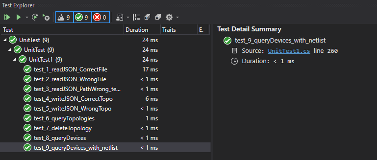

# API_TOPOLOGY
 electronics devices topology tools api using C#

## Enviornment
1- Visual Studio 2019  
2- .NET SDK (5.0.403)

## Why C# ?
1- It's My favourate OOP language. I write too many OOP code with it in programming games.  
2- C# has been evolving fast in recent years.  
3- Run in VS 2019 which has powerful debuggin tools and managing packaging.  
4- In my opinion It's take the best of java and configure it to be similar to C++.

## Documentation
API level documentation and class level documentation in this pdf [TOPOLOGY API DOCUMENTATION.pdf](https://github.com/MostafaAkrsh/API_Topology/blob/main/TOPOLOGY%20API%20DOCUMENTATION.pdf)

## Automated Build
using CAKE  
To Build the code write in root directory of the project  
`dotnet cake`

## Testing
using MSTEST  
### test results
  

## Static Analysis Tool
StyleCop Analyzer

## Using the library
You can use the library by reference another project to it or to edit the main function.

